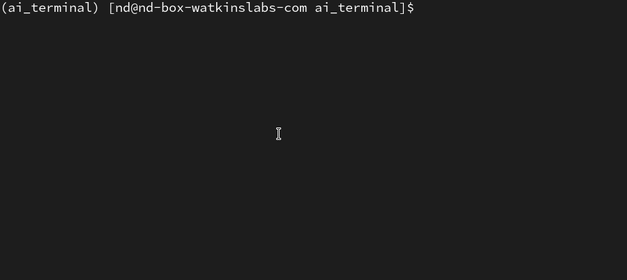

# ai-terminal

a simple cli input for a local LLM wrapped with instructions to pretend to be a terminal

## Setup

```bash
# create your local env for this
pipenv shell

# install the deps
pipenv install transformers
```

## Run

```bash
# if you're not in your local env, get in it
pipenv shell

# run it
python aiterm.py --model-dir <your model dir>
```

## Example

